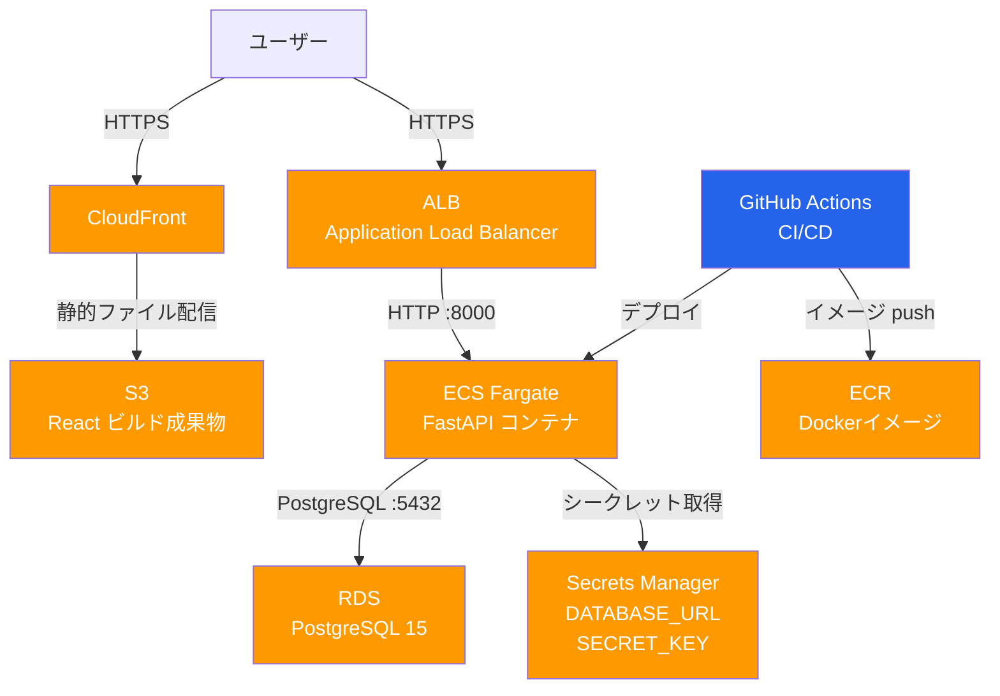
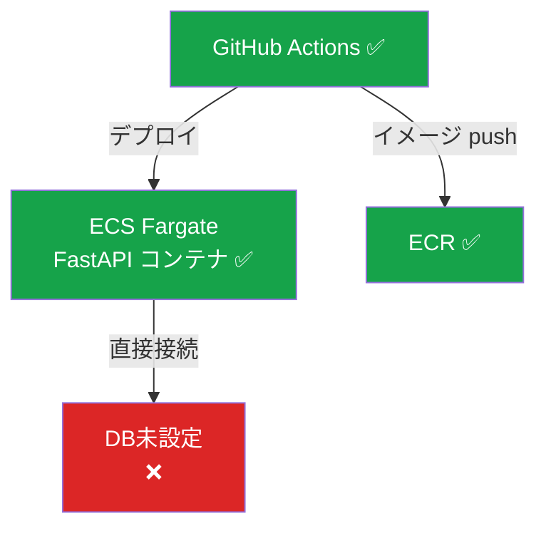

# インフラ構成ドキュメント

**作成日**: 2026-05-24  
**AWS リージョン**: ap-northeast-1（東京）

---

## 1. 構成図

### 本番環境（目標構成）



### 現在の構成（構築済み）



---

## 2. AWS リソース一覧

### 構築済み

| リソース | 名前 | 状態 |
|---------|------|------|
| VPC | vpc-0c786c49b79d3309f (デフォルト) | ✅ 稼働中 |
| ECR リポジトリ | memo-fastapi-dev | ✅ 稼働中 |
| ECS クラスター | memo-fastapi-cluster | ✅ 稼働中 |
| ECS サービス | memo-fastapi-service | ✅ 稼働中（2タスク） |
| ECS タスク定義 | memo-fastapi-task:1 | ✅ 登録済み |

### 未構築（今後作成が必要）

| リソース | 用途 | 優先度 |
|---------|------|--------|
| RDS PostgreSQL | 本番データベース | 高 |
| Secrets Manager | DATABASE_URL・SECRET_KEY の管理 | 高 |
| ALB | HTTPS ロードバランサー | 高 |
| S3 バケット | React ビルド成果物の配信 | 中 |
| CloudFront | フロントエンド CDN・HTTPS 化 | 中 |
| Route 53 | 独自ドメイン（任意） | 低 |
| ACM | SSL 証明書 | ALB・CF と同時 |

---

## 3. ネットワーク構成

```
VPC: 172.31.0.0/16 (デフォルト VPC)
│
├── パブリックサブネット
│   ├── ALB
│   └── ECS Fargate（パブリック IP あり）
│
└── プライベートサブネット（推奨・未構築）
    └── RDS PostgreSQL
```

### セキュリティグループ（設計）

| SG 名 | インバウンド | 対象 |
|-------|------------|------|
| sg-alb | 443 (HTTPS) from 0.0.0.0/0 | ALB |
| sg-ecs | 8000 from sg-alb | ECS タスク |
| sg-rds | 5432 from sg-ecs | RDS |

---

## 4. CI/CD パイプライン

```
git push → main ブランチ
    │
    ▼
GitHub Actions (.github/workflows/deploy.yml)
    │
    ├── 1. AWS 認証
    ├── 2. ECR ログイン
    ├── 3. Docker イメージビルド
    ├── 4. ECR へプッシュ
    └── 5. ECS サービス強制更新
```

### GitHub Secrets（設定が必要）

| シークレット名 | 内容 |
|--------------|------|
| AWS_ACCESS_KEY_ID | IAM ユーザーのアクセスキー |
| AWS_SECRET_ACCESS_KEY | IAM ユーザーのシークレットキー |

---

## 5. ECS タスク定義

**現在の設定** (`memo-fastapi-task:1`)

| 項目 | 値 |
|------|-----|
| 起動タイプ | Fargate |
| CPU | 512 (0.5 vCPU) |
| メモリ | 1024 MB |
| コンテナポート | 8000 |
| ログ | CloudWatch Logs (`/ecs/memo-fastapi`) |

**不足している設定**
- `DATABASE_URL` 環境変数（Secrets Manager から取得）
- `SECRET_KEY` 環境変数（Secrets Manager から取得）

---

## 6. デプロイ手順（完成後）

```bash
# 自動デプロイ（GitHub Actions）
git push origin main
# → 自動でビルド・ECR プッシュ・ECS デプロイが走る

# 手動デプロイ（deploy.sh）
./deploy.sh
```

---

## 7. 構築ロードマップ

| フェーズ | 作業内容 | 状態 |
|---------|---------|------|
| Phase 1 | ECR・ECS クラスター・サービス作成 | ✅ 完了 |
| Phase 2 | RDS 作成・Secrets Manager 設定 | 🔲 未着手 |
| Phase 3 | タスク定義更新（環境変数追加） | 🔲 未着手 |
| Phase 4 | ALB 作成・ECS と紐付け | 🔲 未着手 |
| Phase 5 | S3・CloudFront でフロントエンド配信 | 🔲 未着手 |
| Phase 6 | GitHub Secrets 設定・CI/CD 動作確認 | 🔲 未着手 |
| Phase 7 | 独自ドメイン・HTTPS 化（任意） | 🔲 未着手 |

---

## 8. コスト試算（月額）

| リソース | スペック | 概算コスト |
|---------|---------|-----------|
| ECS Fargate | 0.5vCPU / 1GB × 1タスク | 約 $15 |
| RDS | db.t3.micro / 20GB | 約 $15（無料枠 12ヶ月） |
| ALB | 1台 | 約 $20 |
| S3 + CloudFront | 小規模 | 約 $1 |
| Secrets Manager | 2シークレット | 約 $1 |
| **合計** | | **約 $52/月（約 8,000円）** |

> 無料枠期間中は RDS 代が 0 円になるため約 $37/月

---

## 9. 参考コマンド

```bash
# ECS サービスの状態確認
aws ecs describe-services \
  --cluster memo-fastapi-cluster \
  --services memo-fastapi-service \
  --region ap-northeast-1

# ECR へのログイン
aws ecr get-login-password --region ap-northeast-1 \
  | docker login --username AWS --password-stdin \
  632752099901.dkr.ecr.ap-northeast-1.amazonaws.com

# タスクのログ確認
aws logs tail /ecs/memo-fastapi --follow
```
